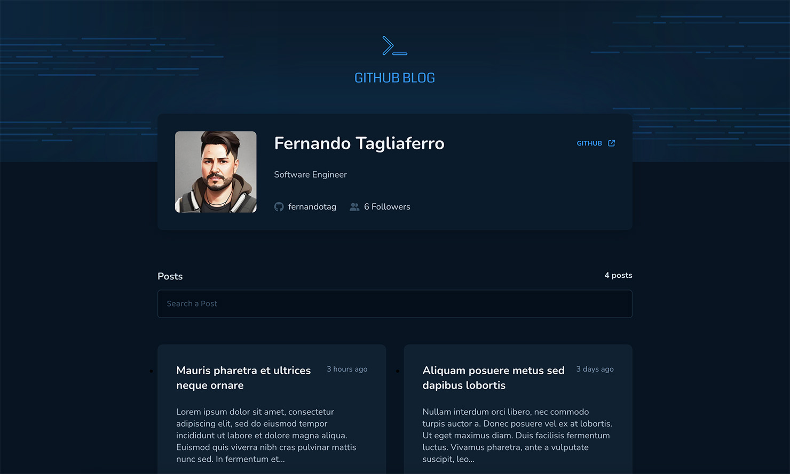
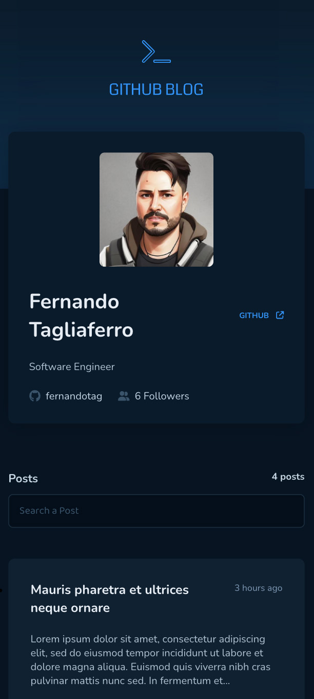

<p align="center">
  
</p>
<p align="center">	
  
  
  
  <a href="https://github.com/fernandotag/github-blog/commits/main">
    
  </a> 
  
  
</p>

<p align="center">
  <a href="#about-the-project">About the project</a>&nbsp;&nbsp;&nbsp;|&nbsp;&nbsp;&nbsp;
  <a href="#layout">Layout</a>&nbsp;&nbsp;&nbsp;|&nbsp;&nbsp;&nbsp;
  <a href="#tecnologies">Tecnologies</a>&nbsp;&nbsp;&nbsp;|&nbsp;&nbsp;&nbsp;
  <a href="#how-to-run">How to run</a>&nbsp;&nbsp;&nbsp;|&nbsp;&nbsp;&nbsp;
  <a href="#license">License</a>
</p>

## <a name="about-the-project"></a>About the project

This project is a challenge from Rocketseat's Ignite course. The goal is to create a repository on Github, add some issues as a posts. And based on these issues (posts), create a blog using the Github API to retrieve all the data.

You can:
- list all posts
- show only posts by published status
- filter posts by query string
- show intire post

👉 Link to access: [https://fernandotag.github.io/github-blog/](https://fernandotag.github.io/github-blog/)

## <a name="layout"></a>Layout


<br />


### <a name="tecnologies"></a>Tecnologies

- GitHub API
- ReactJS
- ViteJs
- Typescript
- Styled Components
- React Router
- Axios
- ESLint
- GitHub Actions
- SonarCloud
- Date FNS
- React Markdown
- Fontawesome

## How to run
**1.** Clone this project
```
git clone git@github.com/fernandotag/github-blog
``` 
**2.** Open the project folder github-blog in your system's shell
```
cd github-blog
``` 
**3.** install the project's dependencies
```
npm install
```
**4.** run the app
```
npm run dev
```

## License

Released in 2023 :closed_book: License

This project is under the [MIT license](./LICENSE).

Give a ⭐️ if this project helped you!
